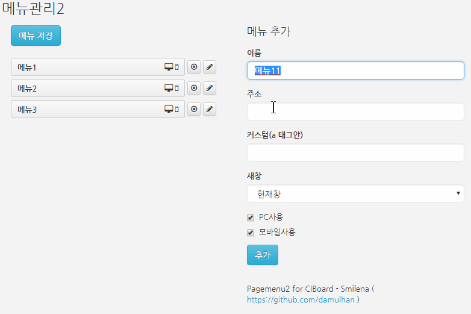

# CIBoard-Pagemenu2

씨아이보드(CIBoard)는 코드이그나이터(CodeIgniter) 기반 공개형 게시판입니다. 

Pagemenu2는 CIBoard의 기본 관리자 메뉴 기능을 확장한 메뉴 편집기입니다. 기존 메뉴가 2단 편집 밖에 되지 않는게 안타까워서 만들어보았습니다. 기존 메뉴보다 좀 더 편리한 인터페이스로 메뉴를 편집할 수 있도록 했습니다. 

### 주요 기능 

- 다단 메뉴 
- 마우스로 메뉴순서와 메뉴깊이을 자유스럽게 변경 가능 (워드프레스와 비슷한 직관적 메뉴관리)
- 화면 전환없이 서버에 반영 (Ajax이용)

### Screenshot

</img> 

### 설치방법

1. 다운로드 받은 파일을 압축을 해제합니다.
2. 압축해제된 폴더 및 파일을 씨아이보드의 해당하는 위치에 복사해줍니다. 
3. application/config/admin_menu_100.php 은 관리자페이지에 보이는 메뉴에 관한 설정입니다. 참고하여 적절히 편집해줍니다. 

### 관련 링크 
* CIBoard github: https://github.com/theciboard/ciboard3-pro 
* CIBoard homepage: http://www.ciboard.co.kr
* Nestable jQuery Plugin: http://dbushell.com/
* Backbone.js: http://backbonejs.org

